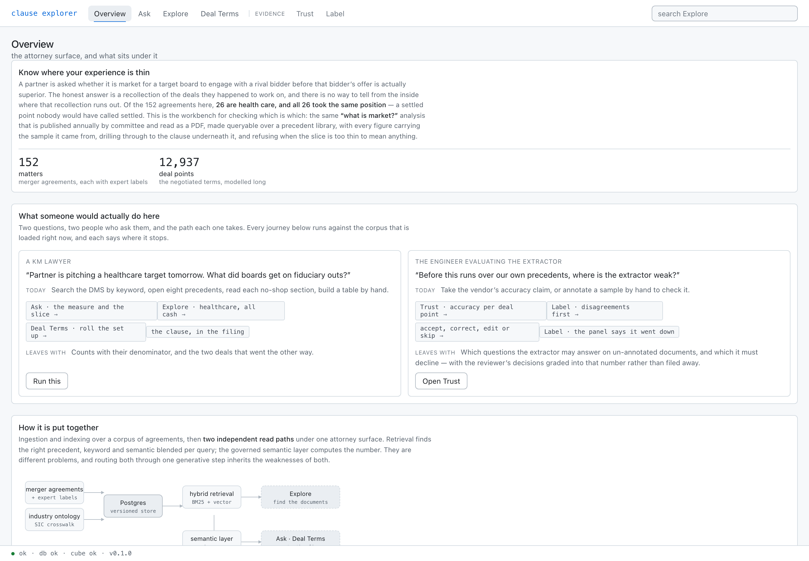
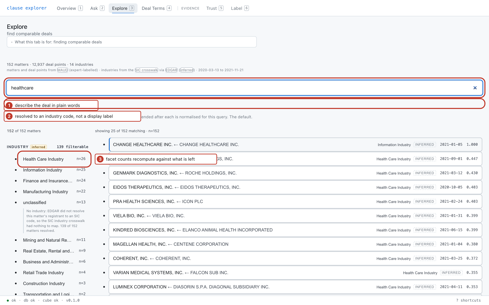
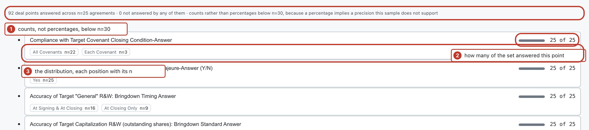
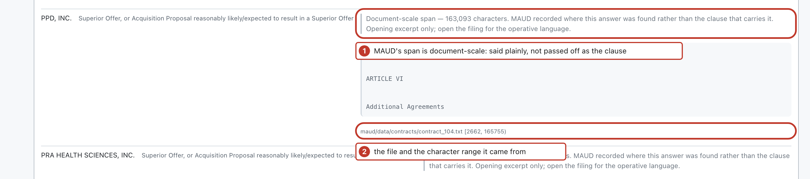
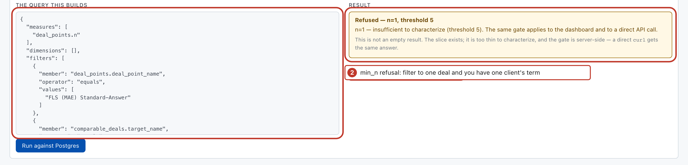
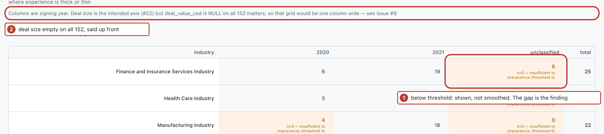
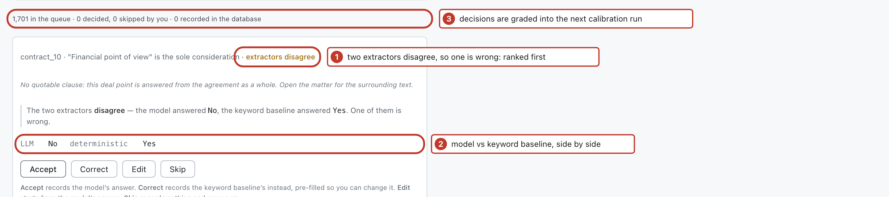

# Clause Explorer

A comparable-deals workbench for transactional contract work. Find deals like the one in front of
you, see what was negotiated across them, and know where your experience is thin.



*The landing tab. Three questions, the person who asks each one, what it costs them today, and the
clicks that answer it. **Run this** lands on the first step already filtered. The tab bar splits
after Coverage: four tabs are the product, four are the evidence that its answers are trustworthy.*

## Three journeys

**1 · The comparables request.** *A knowledge-management analyst: "Partner is pitching a healthcare
target tomorrow, all cash. What did boards get on fiduciary outs?"* Today: search the document
system by keyword, open eight agreements, read each no-shop section, build a table by hand.



*Explore. A plain-English description plus one facet narrows 152 agreements to 25, ranked by hybrid
retrieval. Add the All Cash facet and it is 20. Note the header: **139 filterable**, not 152. Thirteen
matters have no industry at all, and the count says what the dimension can actually narrow. Every row is badged **INFERRED**, because
industry is derived from the SEC's coarse self-assigned code rather than a lawyer's label.*



*Deal Terms. The comparison an associate builds by hand from a stack of agreements: 90 deal points
answered across n=20, two answered by none of them. Nothing renders as a percentage below n=30,
because a percentage implies a precision the sample cannot support. Each row carries its full
answer distribution, since "21 of 21 present" would hide the disagreement that matters — on this
slice, specific performance is "entitled to" in 19 and "entitled to seek" in one.*



*The drill-through, and the honest half of it. MAUD records where in the agreement an answer was
found, which for holistic deal points is most of the document — the span here is 238,751 characters.
Presenting that under the word "clause" showed a table of contents, so a span wider than
`max_clause_chars` is labelled a document-scale span and shown as a bounded excerpt.*

**2 · Is that actually market?** *An associate: "A partner said everyone is doing commercially
reasonable efforts now. Is that true?"* On the healthcare all-cash slice it is not: flat covenant 9,
commercially reasonable 8, reasonable best 3, across n=20. Narrow it further and the gate takes
over.



*Semantic Layer. The agent selects from named measures and dimensions and nothing else — there is no
free-text box in the builder, which is the point. Here a query has been narrowed to a single company,
and the server **refuses**: `n=1, threshold 5`. That gate is server-side, so a raw `curl` gets the
same answer.*



*Coverage. Where the corpus is thick or thin. The sparse cells are the prominent ones, because a gap
is a finding about the corpus rather than something to smooth over.*

**3 · Where can the extractor be trusted?** *A data manager: "Before this runs over our own
precedents, where is it weak?"* Admin publishes accuracy per deal point on held-out gold; Label
queues the disagreements, and the next calibration run grades those decisions in place of the
model's, so the accuracy table moves.



*Label. Two extractors read the same contract: a language model and a keyword baseline. Where they
disagree, at least one is wrong, which is the cheapest useful ranking signal available before any
calibrated confidence score exists. Decisions are graded into the next calibration run, and on the
six recorded so far they lower the score rather than raise it.*

## The problem

A partner pitching a healthcare private-equity sponsor needs, by tomorrow: *our comparable deals
(healthcare, sponsor-side, $200M–1B, last five years), with what was negotiated in each, and a
paragraph for the pitch deck.*

Today that takes a knowledge-management professional days, across three systems, and the answer
comes back incomplete. It's one of the most-complained-about problems in law firm KM, and it's the
reason legal-matter taxonomies exist at all — you cannot answer "healthcare PE deals" unless matters
are described consistently.

## What it does

The four tabs an analyst uses:

| | |
|---|---|
| **Explore** | Faceted comparable-deal search. Filter by industry, signing year and consideration type; facet counts recompute live against whatever is left. Ranked by hybrid retrieval. |
| **Deal Terms** | Rollup across the selected set, with the full answer distribution per row, drilling through to the source text at a character range in the filing. |
| **Coverage** | Where experience is thick or thin. Thin cells are the signal — a gap is more actionable than a strength you already know about. |
| **Overview** | The three journeys above, each runnable from the card. |

And the four behind the divider, which are the evidence rather than the product:

| | |
|---|---|
| **Semantic Layer** | The vocabulary the agent may select from, read live from Cube, with a query builder that has no free-text box and an offline grade of the selections. |
| **Tables / Admin** | Browsable raw data, ingest status, the calibration tables, eval results, and live structured logs. |
| **Label** | A review queue ranked by disagreement between two extractors. Decisions feed the next calibration run. Honest caveat: every queued item is a held-out matter that already has a lawyer's answer, so reviewing it teaches the system nothing gold did not; the mechanism earns its keep on un-annotated documents. |

## Why it refuses to answer sometimes

Slice a few hundred deals by industry × size × term and cells get thin fast. Reporting a median over
three deals as "market" is the failure this domain punishes, so below a configurable `min_n` the
answer is `n=3 — insufficient to characterize`, not a confident number. Every figure carries its
denominator; counts render as "6 of 8" rather than "75%" when the sample can't support a percentage.

That threshold does three jobs at once: statistical honesty, extraction-confidence gating, and
**k-anonymity** — because an analyst who can filter until n=1 has extracted a single client's
negotiated term through the aggregate layer without ever retrieving a document.

## Why a semantic layer

An agent answering analytical questions has two independent ways to be wrong: the number, and the
*definition* of the number. Text-to-SQL leaves both open and is hard to grade — you end up diffing
freeform queries.

Putting [Cube Core](https://cube.dev) (Apache-2.0) between the agent and the warehouse means metrics
are defined once in versioned YAML, and the agent selects from *named measures* over a metadata
endpoint. The number is computed by Postgres, never generated by the model. Correctness becomes
discrete. Did it pick the right measure and filters? That is gradeable offline, with no database
and no LLM in the loop.

The risk doesn't vanish, it relocates: a wrong *selection* returns a real number for the wrong
question. So the resolved query is shown above every answer (`median RTF · healthcare · $200M–1B ·
n=8`), putting a misinterpretation in front of the one person qualified to catch it.

## Data

| Source | What | License |
|---|---|---|
| [MAUD](https://www.atticusprojectai.org/maud/) | 152 real merger agreements, 47k+ expert annotations across the 92 ABA Public Target Deal Points | CC BY 4.0 |
| [FOLIO](https://github.com/alea-institute/FOLIO) | 18,000+ legal concepts in OWL — the dimension vocabulary | CC BY |
| SEC EDGAR | industry (SIC), dates and parties for the same agreements, matched to the deal's target | public |

MAUD's expert annotations are the product data — we don't re-extract what lawyers already labeled.
Extraction is a separate **calibration experiment**: run the extractor over a held-out MAUD slice,
compare against the labels, publish the accuracy per deal point. That's what makes the claim
"usable on documents nobody annotated" testable rather than asserted.

## Limitations

Every figure below comes from a command that ran. What the product does not do, stated here
rather than discovered later.

- **Industry is inferred, on every matter.** A checked-in SIC to FOLIO crosswalk over the SEC's
  self-assigned code resolves 139 of 152. The registrant is constrained to the deal's *target*
  using MAUD's own deal name, so the buyer's industry can no longer land on the seller's deal,
  and a matter whose target does not resolve keeps NULL rather than being filled from whoever
  filed. A 20-matter hand check found the registrant was the target in 19 and NULL in 1, with no
  acquirers; the previous rule scored 14 target, 3 acquirer, 2 wrong entity and 1 NULL on the
  same 20, and across all 152 it picked the acquirer 15 times. The grouping is ours: it puts
  pharma, biotech, devices and CROs under Health Care, which is 26 matters.
- **Deal value is empty** for all 152 matters. EDGAR's company endpoints do not carry
  transaction value, so there is no size filter (#46). Consideration type, a MAUD expert label,
  is the third facet instead.
- **The corpus is 20 months**, 2020-03-13 to 2021-11-21.
- **Most recorded spans are not clauses, and anchoring did not change that.** Over the 12,442
  deal points with a span, the median width is 4,658 characters and the 90th percentile is
  238,949: MAUD marks where an answer was found, which for a holistic deal point is most of the
  agreement. Ingest now locates each annotation's own quoted text inside its span and stores it
  as `anchored` where it appears exactly once, which is 7,476 of 12,937. Every one of those
  landed on a span byte-identical to the one it replaced, so 4,966 stay `recorded` and anything
  wider than 6,000 characters still renders as a labelled excerpt rather than as the clause. A
  further 495 have no span at all; searching those against the whole document recovered none. An
  excerpt found more than once is a miss, never a guess, and no offset is ever approximated.
- **Closing the review loop made the score worse.** Calibration prefers a Label-tab decision over
  the model's answer for the same matter and deal point, then grades it against MAUD like any
  other answer. On the six decisions recorded so far that moves 569 correct to 565 out of 1,701,
  because the extractor was right on four of the pairs a reviewer touched. A label substitutes,
  it does not correct, which is what stops the loop being a ratchet that can only report
  improvement.
- **The extractor is mostly below its own gate.** Of 90 measured deal points, 5 clear 0.70 and 77
  fall below it; median accuracy is 0.25 and six score zero. Two more of the 92 in the vocabulary
  cannot be measured on this holdout and report as not measured rather than as zero. The gate
  reads the lower confidence bound, so a thin sample cannot be flattered past it, and it never
  applies to MAUD's own labels.

## Stack

Python 3.12 · FastAPI · Postgres 16 · Cube Core · React + TypeScript + Vite · rdflib · rank-bm25 ·
structlog. All open source. Retrieval, facets, coverage, and every table view work **without an API
key**; the key is needed only for generation and fresh embeddings.

## Walkthrough

Worked examples with real observed output from the running stack:
[`docs/walkthrough.md`](docs/walkthrough.md). The three journeys above, narrated end to end with
every figure verified against a live instance: [`docs/demo-scripts.md`](docs/demo-scripts.md).

The annotated screenshots in this README are generated, not captured by hand:
`cd frontend && node scripts/shots.mjs` re-shoots the whole set against a running app, locating
each callout by CSS selector, so they cannot silently drift from the UI.

## Quickstart

```bash
cp .env.example .env      # OPENAI_API_KEY optional — most of the app runs without it
docker compose up --build
make ingest               # FOLIO -> MAUD -> EDGAR enrich, idempotent
```

- App → http://localhost:5173
- API docs → http://localhost:8000/docs
- Cube playground → http://localhost:4000

## Development

```bash
make test     # everything that runs with no API key
make check    # ruff, mypy, tsc, tests — what CI enforces
make eval     # eval + calibration harnesses; writes docs/results/
make logs     # tail structured logs
```

## License

Code MIT. Corpora are CC BY (MAUD, FOLIO) — attribution and provenance, including download
commands and checksums, in `docs/provenance.md`.
