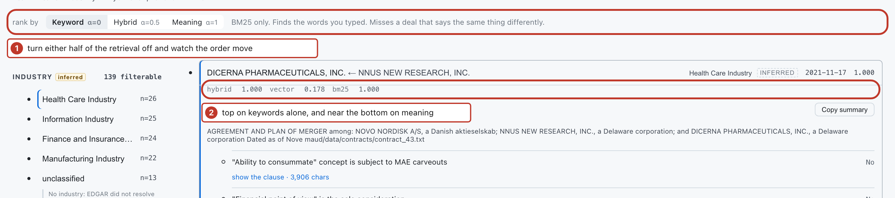
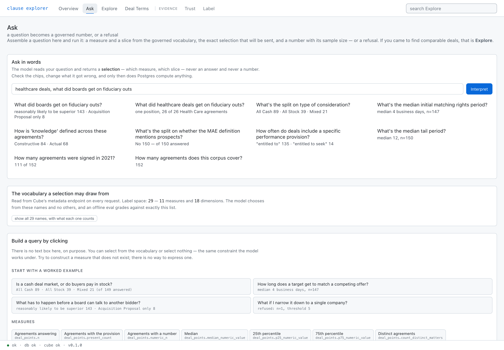
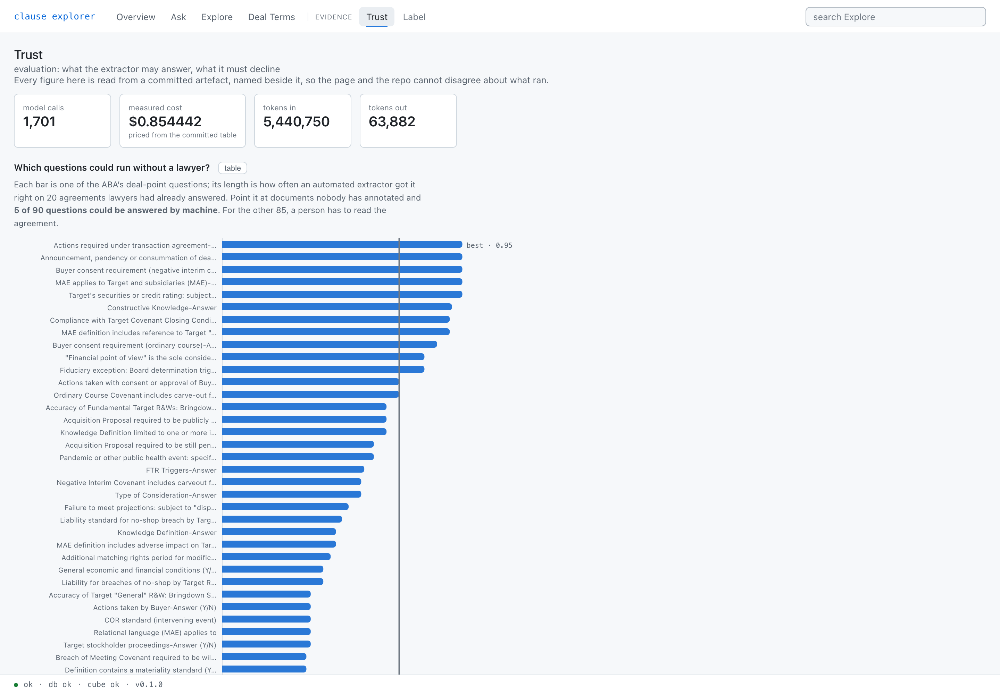

# Clause Explorer

A comparable-deals workbench for transactional contract work. Find deals like the one in front of
you, see what was negotiated across them, and see the evidence for every number before you repeat
it to a partner.

Every figure in this file came from a command that ran against a live instance. The commands are
here too, so you can re-run them and disagree with me.


*The landing tab. Two questions, the person who asks each one, what it costs them today, and the
clicks that answer it. **Run this** lands on the first step already filtered. The tab bar splits:
four tabs are the product, two are the evidence that its answers are trustworthy.*

---

## The problem

A partner pitching a healthcare private-equity sponsor needs, by tomorrow: *our comparable deals,
what was negotiated in each, and a paragraph for the pitch deck.*

Today that takes a knowledge-management professional days, across three systems, and the answer
comes back incomplete. The ABA produces its Public Target Deal Points Studies by hand, annually, by
committee — because knowing what's market genuinely matters and nobody made it queryable.

This makes it queryable with the discipline the manual version has and most AI tools drop: every
figure carries its sample size, drills through to the text behind it, and the system refuses to
characterize a slice too thin to support a claim.

## The corpus

```bash
docker compose exec -T db psql -U explorer -d explorer -c "
  SELECT (SELECT count(*) FROM matters)                                   AS matters,
         (SELECT count(*) FROM deal_points)                               AS deal_points,
         (SELECT count(DISTINCT deal_point_name) FROM deal_points)        AS distinct_points,
         (SELECT count(*) FROM matters WHERE industry_code IS NOT NULL)   AS with_industry,
         (SELECT min(signing_date) FROM matters)                          AS first_signing,
         (SELECT max(signing_date) FROM matters)                          AS last_signing;"
```

```
 matters | deal_points | distinct_points | with_industry | first_signing | last_signing
     152 |       12937 |              92 |           139 |    2020-03-13 |   2021-11-21
```

152 real merger agreements from [MAUD](https://www.atticusprojectai.org/maud/), carrying 12,937
lawyer-written answers across the 92 ABA Public Target Deal Points. Industry comes from a checked-in
SIC crosswalk over EDGAR, and resolves on 139 of the 152. Health Care is the largest group at 26.

---

# 1 · Retrieval, and how to check it

Explore ranks the filtered set with a blend of two retrievers: BM25 over the matter summary, and
cosine similarity over an embedding of it. The claim that blending beats either alone is only worth
something if you can turn each half off, so the blend weight is a control under the search box.



*Keyword-only ranking on the Health Care slice. Dicerna is first on a perfect BM25 match with a
vector score of 0.178 — the words matched, the meaning did not.*

## Run it yourself

```bash
for A in 0 0.5 1; do
  curl -s localhost:8000/comparables -H 'content-type: application/json' -d "{
    \"description\": \"healthcare take-private with a go-shop\",
    \"folio_industry_code\": \"RCSG4k3ah1Pu5YgPexPgOmL\",
    \"alpha\": $A, \"limit\": 3}"
done
```

Three settings of one knob over the same 26 candidates. Each cell is the matter and its own two
scores as `bm25 / vector`, the same pair every time, so the columns compare:

| | 1st | 2nd | 3rd |
|---|---|---|---|
| **Keyword** α=0 | Dicerna `1.000 / 0.178` | GenMark `0.940 / 1.000` | Constellation `0.825 / 0.225` |
| **Meaning** α=1 | GenMark `0.940 / 1.000` | Magellan **`0.000`** ` / 0.827` | Varian **`0.000`** ` / 0.817` |
| **Hybrid** α=0.5 | GenMark `0.940 / 1.000` | Viela `0.806 / 0.734` | Five Prime `0.547 / 0.645` |

Two things the table shows and prose cannot. Keyword alone puts **Dicerna** first on a perfect word
match against a vector score of 0.178. Meaning alone surfaces **Magellan and Varian at bm25 exactly
0.000** — they share no query terms at all. The blend keeps what both halves agree on, and Dicerna
falls from 1st to 4th.

## Why both halves are normalized first

BM25 is unbounded; cosine sits in [0, 1]. On this corpus BM25's spread is roughly 25× cosine's, so
blending the raw numbers makes `alpha` decorative — the keyword half wins at every setting. Both are
min–max normalized **per query** before the blend.

```python
# backend/explorer/retrieval/hybrid.py

def normalize(scores: np.ndarray) -> np.ndarray:
    """Min-max to [0, 1]. A flat distribution maps to zeros, not to NaN — every document
    being equally (ir)relevant must not poison the blend with division by zero."""
    if scores.size == 0:
        return scores
    low, high = float(scores.min()), float(scores.max())
    if high - low < 1e-12:                       # every score identical
        return np.zeros_like(scores, dtype=np.float32)
    return ((scores - low) / (high - low)).astype(np.float32)


class HybridIndex:
    def search(self, query: str, alpha: float = DEFAULT_ALPHA, limit: int = 10) -> list[Scored]:
        bm25_raw = np.asarray(self.bm25.get_scores(tokenize(query)), dtype=np.float32)

        query_vector = np.asarray(self.cache.embed(query), dtype=np.float32)
        norm = np.linalg.norm(query_vector)
        vector_raw = self.matrix @ (query_vector / (norm if norm else 1.0))

        # normalize BOTH before combining — raw BM25 would dominate at every alpha
        bm25 = normalize(bm25_raw)
        vector = normalize(vector_raw)
        blended = alpha * vector + (1.0 - alpha) * bm25

        order = np.argsort(-blended)[:limit]
        return [
            Scored(
                matter_id=self.ids[i],
                score=float(blended[i]),
                vector_score=float(vector[i]),   # both halves travel to the UI, so a
                bm25_score=float(bm25[i]),       # ranking can be argued with
            )
            for i in order
        ]
```

## Filter before rank, never after

Ranking the corpus and then dropping out-of-filter results is the obvious implementation and it is
wrong twice: a request for ten healthcare comparables comes back with three, and the scores that
survive were normalized against a corpus nobody asked about. The industry filter runs in Postgres
first; the index is built over exactly the survivors.


*Note the header: **139 filterable**, not 152. Thirteen matters have no industry at all, and the
count says what the dimension can actually narrow. Every row is badged **INFERRED**, because industry
is derived from the SEC's coarse self-assigned code rather than a lawyer's label.*

---

# 2 · The semantic layer, and why the model never writes SQL

An agent answering analytical questions has two independent ways to be wrong: **the number**, and
**the definition of the number**. Text-to-SQL leaves both open and is hard to grade — you end up
diffing freeform queries.

[Cube Core](https://cube.dev) sits between the agent and Postgres. Metrics are defined once in
versioned YAML, and the model selects from *named measures* rather than generating SQL. The number
is computed by Postgres. Correctness becomes discrete: did it pick the right measure and filters?
That is gradeable offline, with no database and no model in the loop.

## The vocabulary is read live, and becomes a JSON-schema enum

```bash
curl -s localhost:8000/agent/catalog | jq '{measures: (.measures|length),
                                            dimensions: (.dimensions|length),
                                            label_space}'
```

```json
{ "measures": 11, "dimensions": 18, "label_space": 29 }
```

Those 29 names are not a prompt instruction. They are the `enum` in the structured-output schema, so
an invalid name **cannot be decoded** — not merely discouraged.

```python
# backend/explorer/agent/select.py

@dataclass(frozen=True)
class Vocabulary:
    measures: tuple[str, ...]
    dimensions: tuple[str, ...]

    def as_json_schema_properties(self) -> dict[str, Any]:
        """The structured-output schema: measure/dimension NAMES are enums, so an invalid
        name cannot be decoded — not merely discouraged by instructions in the prompt."""
        return {
            "measures": {
                "type": "array",
                "items": {"type": "string", "enum": list(self.measures)},
            },
            "dimensions": {
                "type": "array",
                "items": {"type": "string", "enum": list(self.dimensions)},
            },
            "filters": {
                "type": "array",
                "items": {
                    "type": "object",
                    "properties": {
                        "member": {"type": "string",
                                   "enum": list(self.measures + self.dimensions)},
                        "operator": {"type": "string",
                                     "enum": ["equals", "contains", "gt", "lt"]},
                        "values": {"type": "array", "items": {"type": "string"}},
                    },
                    "required": ["member", "operator", "values"],
                    "additionalProperties": False,
                },
            },
        }


def select_with_usage(question: str, vocabulary: Vocabulary, api_key: str) -> SelectionCall:
    """The only function in this module that calls out. Everything else is pure and
    testable with no key."""
    response = OpenAI(api_key=api_key).chat.completions.create(
        model=SELECT_MODEL,
        messages=[{"role": "system", "content": SYSTEM_PROMPT},
                  {"role": "user",   "content": question}],
        response_format={
            "type": "json_schema",
            # strict=True is what makes the enum binding rather than advisory
            "json_schema": {"name": "cube_selection", "schema": schema, "strict": True},
        },
    )
```



*Ask. The vocabulary panel is Cube's `/meta`, read live rather than checked in — a stale copy could
disagree with the YAML, and then any selection failure becomes an unfalsifiable argument.*

## Three requests that show the whole mechanism

**A name outside the vocabulary is rejected before Cube is touched.**

```bash
curl -s localhost:8000/agent/run-selection -H 'content-type: application/json' \
  -d '{"measures":["deal_points.n"],"dimensions":["matters.industry_label"],"filters":[]}'
```
```json
{"error": {"code": "validation_error",
           "message": "'matters.industry_label' is not a known dimension."}}
```

**A valid selection returns the exact Cube payload alongside the rows.** Fiduciary exception, board
determination trigger, across the whole corpus:

```json
"rows": [
  {"deal_points.position": "Superior Offer, or Acquisition Proposal reasonably likely/expected
                            to result in a Superior Offer", "deal_points.n": "143"},
  {"deal_points.position": "Acquisition Proposal only",     "deal_points.n": "8"}
]
```

Add `comparable_deals.label = "Health Care Industry"` and it is 26, all one way.

**Narrow to a single deal and the server refuses.**

```json
{"rows": [], "n": 1, "refused": true, "threshold": 5,
 "message": "n=1 — insufficient to characterize (threshold 5). The same gate applies to the
             dashboard and to a direct API call."}
```


## The refusal is a shape, not an empty list

```python
# backend/explorer/api/run_selection.py

n = _n_from(rows)
if n is not None and n < settings.min_n:
    # Refusal is its own shape, never an empty row list with a 200 — "we will not answer
    # this" and "there is nothing here" are different statements about different things.
    log.info("run_selection_refused", n=n, threshold=settings.min_n)
    return RunSelectionResponse(
        query=payload,
        rows=[],                       # suppressed, and said so
        n=n,
        refused=True,
        threshold=settings.min_n,
        message=(
            f"n={n} — insufficient to characterize (threshold {settings.min_n}). "
            "The same gate applies to the dashboard and to a direct API call."
        ),
    )
```

`min_n` does three jobs at once. Statistical honesty; extraction-confidence gating; and
**k-anonymity** — an attorney who can filter until n=1 has extracted one client's negotiated term
through the analytics layer, around the ethical wall, without ever retrieving a document. It is a
confidentiality control, not a nicety.

---

# 3 · The rollup, and the drill-through


*The comparison an associate builds by hand from a stack of agreements. Nothing renders as a
percentage below n=30, because a percentage implies a precision the sample cannot support. Each row
carries its full answer distribution, since "21 of 21 present" would hide the disagreement that
matters.*


*The honest half. MAUD records where in the agreement an answer was found, which for holistic deal
points is most of the document. Presenting that under the word "clause" showed a table of contents,
so a span wider than `max_clause_chars` is labelled a document-scale span and shown as a bounded
excerpt.*

---

# 4 · Trust: what the extractor may answer, and what it must decline

MAUD's annotations **are** the product data — we do not re-extract what lawyers already labelled.
Extraction is a separate calibration experiment: run our extractor over a held-out slice, compare to
the labels, publish accuracy per deal point.



```bash
make eval        # writes docs/results/
curl -s localhost:8000/admin/calibration | jq '{vocabulary_size, measured_deal_point_count,
                                                reportable_count, min_extraction_confidence}'
```
```json
{ "vocabulary_size": 92, "measured_deal_point_count": 90,
  "reportable_count": 5,  "min_extraction_confidence": 0.7 }
```

**5 of 90 measured deal points clear the gate.** Median accuracy is 0.25; six score zero. 1,701
predictions on 20 held-out matters cost **$0.854442** on `gpt-4o-mini`, summed from each call's own
`response.usage`. This is not a flattering number and it is published rather than buried.

The gate reads the **lower** bound of the 95% Wilson interval, not the point estimate, so a thin
sample cannot be flattered past it — 3 of 4 correct reads as 0.75 but its interval reaches 0.30.

```python
# backend/explorer/evals/calibration.py

def wilson_interval(correct: int, n: int, z: float = 1.96) -> tuple[float, float]:
    """95% Wilson score interval — stable at small n and at accuracy near 0 or 1, unlike
    the normal approximation, which can produce bounds outside [0, 1]."""
    if n == 0:
        return 0.0, 0.0
    phat = correct / n
    denom = 1 + z**2 / n
    center = phat + z**2 / (2 * n)
    margin = z * math.sqrt((phat * (1 - phat) + z**2 / (4 * n)) / n)
    return max(0.0, (center - margin) / denom), min(1.0, (center + margin) / denom)


def holdout_pairs(dsn: str | None = None) -> list[tuple[str, str]]:
    """The (matter, deal point) pairs to predict: exactly those MAUD labelled on the holdout.

    This is the unit of cost. Scheduling the full cross product instead would buy
    predictions that cannot be graded, at the same price per call.
    """
```

Thirteen deal points have a point estimate at or above 0.70; eight of those have intervals too wide
to clear it. That is the gate working, not a rounding quarrel.

## The review loop, and the fact that it reports losses


*Two extractors read the same contract: a language model and a keyword baseline. Where they disagree
at least one is wrong, which is the cheapest useful ranking signal available before any calibrated
confidence score exists. The queue holds 1,701 items across 90 deal points.*

Calibration prefers a Label-tab decision over the model's answer for the same pair, then grades it
against MAUD like any other answer — a **substitution**, not a correction.

```
$ PYTHONPATH=backend python -m explorer.evals.calibration
correct 569 of 1701 before, 565 of 1701 after; 6 labels applied, 5 differing
```

**The number went down, and that is the mechanism working.** The extractor happened to be right on
four of the six pairs a reviewer touched, and those four labels are wrong against MAUD. A loop that
could only report improvement would be a loop worth distrusting.

What this does *not* show: every holdout matter already has a lawyer's answer, so a reviewer here
can at best reproduce gold. The loop earns its keep on documents with **no** gold — firm precedents,
where the reviewer's decision is the only answer there is.

---

## Architecture

```
MAUD (152 merger agreements · 12,937 expert labels · 92 ABA deal points · CC BY 4.0)
EDGAR (SIC industry · dates · parties, for the same 152)
SIC crosswalk (data/mappings/sic_to_folio.csv — 120 rows, checked in, auditable)
   │
   ▼  idempotent ingest, provenance recorded
Postgres ──► Cube Core (11 measures + 18 dimensions, defined once in YAML)
   │              │
   │         ┌────┴────┐
   │         ▼         ▼
   │    Dashboard   Agent (reads /meta, emits a selection — never SQL)
   │         └── same governed numbers ──┘
   ▼
Hybrid retrieval (BM25 + vector) ── comparable-deal ranking; NOT via Cube
```

Cube's footprint is bounded on purpose. It powers facet counts and the deal-terms rollup. It does
not do retrieval, ranking, record fetch, or generation.

## The tabs

| | | |
|---|---|---|
| **Overview** | product | the two journeys, each runnable from its card |
| **Ask** | product | a question becomes a governed selection and a number, or a refusal |
| **Explore** | product | faceted comparable search, hybrid ranking, the blend on a control |
| **Deal Terms** | product | the rollup over the selected set, drilling to the source text |
| **Trust** | evidence | accuracy per deal point on held-out gold; ingest and logs below it |
| **Label** | evidence | the review queue, ranked by disagreement; decisions are graded in |

## Data

| Source | What | License |
|---|---|---|
| [MAUD](https://www.atticusprojectai.org/maud/) | 152 merger agreements, 12,937 expert answers across 92 ABA deal points | CC BY 4.0 |
| SEC EDGAR | SIC industry, dates and parties for the same agreements, matched to the deal's target | public |
| `data/mappings/sic_to_folio.csv` | 120-row SIC → industry crosswalk. Checked in because it is curation, not code | CC BY, labels from FOLIO |

## Limitations

What the product does not do, stated here rather than discovered later.

- **Industry is inferred, on every matter.** The crosswalk resolves 139 of 152. The registrant is
  constrained to the deal's *target* via MAUD's own deal name, so the buyer's industry cannot land
  on the seller's deal. A 20-matter hand check found the registrant was the target in 19 and NULL
  in 1, with no acquirers; the previous rule scored 14 target, 3 acquirer, 2 wrong entity, 1 NULL
  on the same 20, and across all 152 it picked the acquirer 15 times.
- **Deal value is empty** for all 152. EDGAR's company endpoints do not carry transaction value, so
  there is no size filter ([#46](https://github.com/xbt-a4224j/clause-explorer/issues/46)).
  Consideration type, a MAUD expert label, is the third facet instead.
- **The corpus is 20 months**, 2020-03-13 to 2021-11-21. It is not a time series.
- **Most recorded spans are not clauses.** Median width 4,658 characters, 90th percentile 238,949.
  Ingest locates each annotation's quoted text inside its span and stores it as `anchored` where it
  appears exactly once — 7,476 of 12,937. An excerpt found more than once is a miss, never a guess,
  and no offset is ever approximated.
- **The extractor is mostly below its own gate**, as published above. It never applies to MAUD's own
  labels: all 12,937 product rows are lawyer annotations, and gating them on a 0.25-median
  extractor accuracy would suppress gold on the strength of a number describing something else.
- **The retrieval improvements are measured but unmerged.**
  [#58](https://github.com/xbt-a4224j/clause-explorer/issues/58) shows raising the extractor's
  context budget from 12,000 to 200,000 characters moves evidence coverage from 40.2% to 89.2% for
  about $13. Coverage is not accuracy, and the paid comparison has not been run.

## Stack

Python 3.12 · FastAPI · Postgres 16 · Cube Core (Apache-2.0) · React + TypeScript + Vite ·
rank-bm25 · structlog. Everything open source except the model.

**An API key is required.** Embeddings, extraction and measure selection all call out. The app used
to boot without one, which cost nothing while nothing in it called a model — and cost a great deal
once the model sat on the user's path in Ask. Tests that make a real call are marked `needs_key` and
excluded from CI, which is a property of the test suite rather than a promise about the product.

## Quickstart

```bash
cp .env.example .env      # set OPENAI_API_KEY
docker compose up --build
make ingest               # MAUD -> EDGAR enrich, idempotent
```

- App → http://localhost:5173
- API docs → http://localhost:8000/docs
- Cube playground → http://localhost:4000

## Development

```bash
make test     # everything that runs with no API key
make check    # ruff, mypy, tsc, tests — what CI enforces
make eval     # calibration + measure-selection harnesses; writes docs/results/
make logs     # tail structured logs
```

```
$ pytest backend/tests -q -m "not needs_key"
462 passed, 3 deselected in 210.43s

$ cd frontend && npx vitest run
Test Files  12 passed (12)
     Tests  224 passed (224)
```

The annotated screenshots above are generated, not captured by hand:
`cd frontend && node scripts/shots.mjs` re-shoots the whole set against a running app, locating each
callout by CSS selector, so they cannot silently drift from the UI.

A longer hands-on tour, with the code beside each screen:
[`docs/walkthrough.md`](docs/walkthrough.md).

## License

Code MIT. MAUD is CC BY 4.0. Attribution and provenance — download commands, byte sizes and
checksums — in `docs/provenance.md`.
